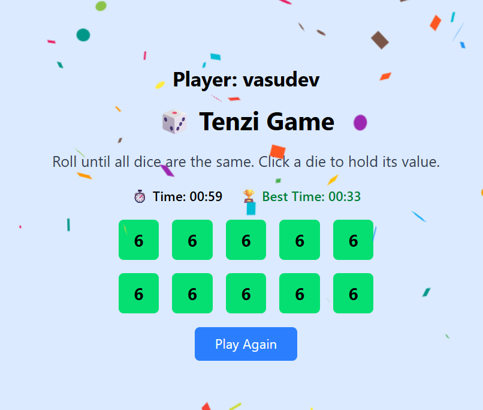

# 🎲 Tenzi Game - React Edition

A fun, interactive dice game built using React! This version of Tenzi includes player name input, win animations, a timer, and high score tracking.

## 🔥 What is Tenzi?

Tenzi is a fast-paced dice game where the goal is to roll all ten dice to show the same number — as quickly as possible! Players keep rolling and holding matching dice until all are the same.

---

## 🚀 Features

- 🎮 **Enter Player Name** before the game starts
- 🎲 **Roll 10 Dice** and hold any of them
- 🧠 **Auto-win detection** when all dice match
- 🎉 **Confetti animation** on winning
- ⏱️ **Game timer** to track your speed
- 🏆 **Best time saved** in Local Storage
- 🔁 **Play Again** button to restart the game
- 🔊 **Sound effect** on win (optional)

---

## 🛠 Built With

- **React**
- **JavaScript (ES6+)**
- **CSS (Flexbox/Grid)**
- [`react-confetti`](https://www.npmjs.com/package/react-confetti)
- `localStorage` for saving best time

---

## 📦 Installation

1. **Clone the repository:**

   ```bash
   git clone https://github.com/your-username/Tenzi-Game.git
   cd Tenzi-Game

---
📸 Screenshots


---
📁 File Structure
src/
├── components/
│   ├── Die.js
│   ├── Timer.js
│   ├── ConfettiEffect.js
├── App.js
├── index.js
├── styles.css


📋 How to Play
1.Click "Start" and enter your name.
2.Roll the dice.
3.Click a die to "hold" its number.
4.Keep rolling until all dice show the same number.
5.Celebrate with 🎉 and beat your best time!
